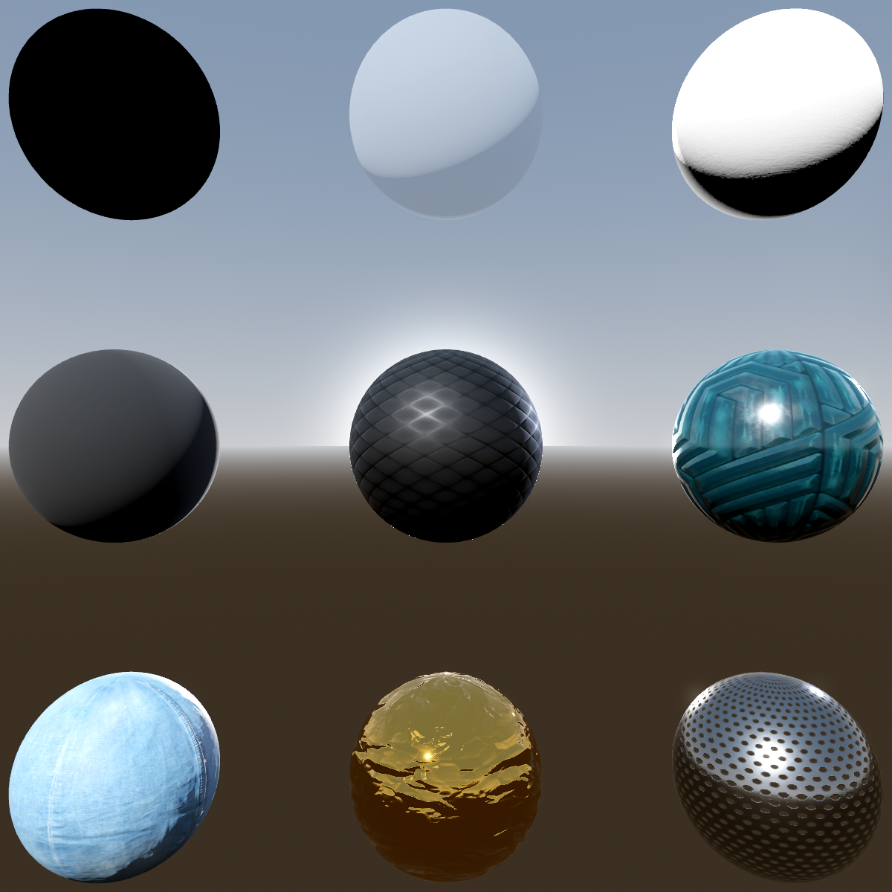

# MaterialX Loader for Godot

Load [MaterialX](https://materialx.org) `.mtlx` files into Godot as
[Visual Shaders](https://docs.godotengine.org/en/stable/tutorials/shaders/shader_reference/spatial_shader.html),
with real material thumbnails in the FileSystem dock.

No C++ build. Copy the `addons/materialx` folder into your project and enable it.



*Nine `.mtlx` files converted and rendered unmodified: Gold, Glass, Rubber and
Grid_Paint in the top row, then Black Upholstery, Glazed Cube Pattern Tiles,
TH Blue Denim Fabric, Gold Foil and Perforated Metal. Every material on this
page went through the same converter — tiling normal maps, height, clearcoat,
sheen and all.**

---

## What it does

Drop a `.mtlx` file anywhere in your project and it becomes a `VisualShader`:

- **Loads directly.** `load("res://art/Bricks.mtlx")` returns a `VisualShader`.
  No import step, no manual conversion.
- **Material thumbnails.** `.mtlx` files show a shaded sphere in the FileSystem
  dock instead of a generic icon.
- **Correct conversion.** Specular reflectance, `mix()` polarity, sRGB handling
  and tangent-space normal maps are converted against the MaterialX and Godot
  specs rather than by eye. Seven of those conversions were silently wrong
  before; the reasoning is in
  [`addons/materialx/README.md`](addons/materialx/README.md).
- **Batch conversion.** Convert a whole folder to `.tres` and repair the import
  settings of the textures those materials use.
- **Live preview.** Pick a material, see the actual converted shader on a sphere.

## Requirements

Godot **4.7**. Verified against 4.7.2.stable. Earlier 4.x releases are not
claimed, because the port indices and enum values this relies on have moved
between minors.

## Install

1. Copy `addons/materialx/` into your project's `addons/` folder.
2. Enable **MaterialX Loader** in *Project → Project Settings → Plugins*.

That is the whole setup. Textures are resolved relative to the `.mtlx` file, so
an unpacked MaterialX library works with no further configuration.

## Project settings

All optional; the defaults work with no configuration.

| Setting | Default | Meaning |
|---|---|---|
| `materialx/texture_roots` | `[]` | Extra directories to search for textures, tried before the `.mtlx`'s own directory. Leave empty for relative-to-source resolution. |
| `materialx/auto_bake_previews` | `true` | Render thumbnails with the real shader in the background. |
| `materialx/preview_size` | `128` | Edge length in pixels of a baked thumbnail. |
| `materialx/custom_lighting` | `true` | Evaluate `diffuse_roughness` with an Oren-Nayar lobe. On by default because the lobe is MaterialX's own answer and Godot has no equivalent; turning it off falls back to Godot's Lambert. See [Oren-Nayar diffuse](#oren-nayar-diffuse) for what this costs. |

Materials with a non-zero `diffuse_roughness` have Godot's whole lighting model
replaced in the light stage, so for those the addon, not the engine, is
responsible for the result. If you would rather have Godot's own BRDF, that
setting is the escape hatch.

This was `materialx/experimental_custom_lighting` and defaulted to off before
1.1.0. An existing value is migrated on first load, so upgrading never silently
changes how your materials render.

## Using the dock

The dock appears on the right-hand side of the editor. It defaults to
**preview only**, so nothing is written until you ask for it.

- **Convert .mtlx to .tres** — batch-convert a folder. This is the path to use
  for an exported build (see below).
- **Repair texture imports** — fix the import settings of the textures a
  material references. A colour map used as `base_color` needs sRGB decoding; a
  tangent-space normal map needs BC5 compression. Getting these wrong makes
  materials look subtly flat or washed out.
- **Rebuild all previews** / **Delete all previews** — clear and regenerate every
  baked thumbnail.

### About thumbnails and restarting the editor

Godot caches each thumbnail in two places. The **on-disk** copy
(`~/.cache/godot/resthumb-<md5>.png`) is keyed on the file's MD5, so an
unchanged material keeps its old thumbnail indefinitely; the addon deletes that
entry after every bake, so this never needs doing by hand.

The **in-memory** copy is checked first and has no clearing API in 4.x. A
thumbnail already generated in the current session therefore shows the old image
until the editor restarts. Per-material refreshes appear to shift the mismatch
rather than fix it — use **Rebuild all previews** and restart once.

## Exporting

An exported game has no editor and therefore no plugin, so **`.mtlx` will not
load at runtime**. Run **Convert .mtlx to .tres** and ship the generated
`.tres`, which is what a build should use anyway: it moves the conversion cost
out of load time.

## Metals look black

Not a conversion bug. A metal has no diffuse response — all of its appearance is
reflection — so with nothing configured to reflect, gold and chrome render as
near-black silhouettes with a single specular dot.

Give the project an environment (`Project → Project Settings → Rendering →
Environment → Default Environment`). Any sky or IBL works; the demo project
ships one. Baked thumbnails use that same environment, so thumbnails and scenes
match.

## Oren-Nayar diffuse

Godot's spatial BRDF has no Oren-Nayar diffuse, so a MaterialX material with a
non-zero `diffuse_roughness` would be rendered with Lambert and quietly lose the
roughness the file asked for. This addon evaluates the lobe instead, by
transcribing Godot's lighting into a light function with the Oren-Nayar term in
place of Lambert.

The transcription is Godot's, not a reimplementation: `D_GGX`, `V_GGX`,
`SchlickFresnel`, the energy-compensation term and the backlight lobe are taken
from `scene_forward_lights_inc.glsl` and `scene_forward_clustered.glsl`, so the
material still tracks the engine when the engine changes. The only substituted
term is

```glsl
float sigma2 = mx_square(diffuse_roughness);
float A = 1.0 - 0.5 * (sigma2 / (sigma2 + 0.33));
float B = 0.45 * sigma2 / (sigma2 + 0.09);
diffuse_brdf_NL = (A + B * stinv) * NdotL / M_PI;
```

which is MaterialX's `mx_oren_nayar_diffuse` verbatim
(`mx_microfacet_diffuse.glsl:8`).

Two consequences worth knowing:

- **The material's lighting comes from this addon, not from Godot.** Writing to
  the light stage sets `LIGHT_CODE_USED`, which makes the engine skip its entire
  lighting model (`scene_forward_lights_inc.glsl:121`). Anything the
  transcription does not cover disappears without an error, which is why the gate
  in [Known limitations](#known-limitations) refuses a material with lobes a
  light function cannot read rather than rendering half of it.
- **Ambient is not darkened to match.** MaterialX scales indirect diffuse by the
  directional albedo; Godot computes ambient in the fragment stage, where the
  light function cannot reach it. On a high-`diffuse_roughness` material the
  ambient reads slightly too bright relative to the direct light.

Set `materialx/custom_lighting` to `false` to fall back to Godot's own BRDF.

## Known limitations

These are honest limits of the conversion, not bugs. They are all detected and
reported in the dock rather than silently approximated.

| Input | Why it is dropped |
|---|---|
| `diffuse_roughness`, when computed rather than written as a literal | Oren-Nayar can only be evaluated in the light stage, and a value computed in a nodegraph has to be a constant there. It is dropped, and the material keeps Godot's Lambert. Set the value directly and it works. |
| The *indirect* half of Oren-Nayar | MaterialX also scales ambient diffuse by the directional albedo (`mx_oren_nayar_diffuse_bsdf.glsl:34`). Godot computes ambient in the fragment stage, outside the light function, so a material with a high `diffuse_roughness` keeps an ambient term that is not darkened to match its direct light. Affects only materials the setting actually reaches. |
| A `diffuse_roughness` material that also has `coat`, `sheen`, `subsurface`, anisotropy or a linked roughness | Those lobes are not readable from a light function at all, so the material keeps Godot's whole lighting rather than half of it. Reported in the dock when it happens. |
| `subsurface_color`, `subsurface_radius`, `subsurface_scale` | Godot's subsurface scattering takes a radius and depth per object, not a per-material colour and radius. |
| `coat_color` | Godot's clearcoat has no tint port. |
| `coat_IOR` | Godot hardcodes the coat IOR at 1.5. |
| `sheen_roughness` | Godot's rim has no roughness term; its exponent comes from the surface roughness instead. |
| `transmission`, `transmission_depth`, `transmission_scatter`, `transmission_color`, `transmission_dispersion` | No refraction lobe in Godot's spatial BRDF. Folded into `ALPHA` (`max(1 - transmission, 0.15)`), which is an approximation. |

Deliberately approximated rather than dropped, because a partial match beats
nothing:

| Input | How it is approximated |
|---|---|
| `sheen` | Mapped to Godot's `RIM`. Both are grazing-angle lobes, so it is a close analogue, not an identity: MaterialX's sheen is retroreflective and roughness-dependent, Godot's rim is fresnel-weighted with an exponent taken from the surface roughness. |
| `sheen_color` | Mapped to `RIM_TINT`, which is a scalar (`mix(white, albedo, rim_tint)`). The colour is reduced to "how far from white", i.e. one minus its Rec.709 luminance, so white — the MaterialX default — is a no-op. Hue is lost: two sheens of equal brightness land on the same tint. |

Other limits:

- A `.mtlx` exporting several `<surfacematerial>` nodes converts only the first.
- The parser handles the subset of MaterialX the loader needs. It does not
  validate against the MaterialX spec; that is what linking libMaterialX buys.
- MaterialX's `colorspace` is read as an annotation on a file input, which is
  how the standard library writes it.

## Validation

The converter was developed against the MaterialX standard library: **277
`.mtlx` files, all converting with 0 failures, 0 shader errors and 0 dangling
connections.** Reproduce it against your own library:

```bash
cd demo
godot --headless --script tests/mtlx_corpus_check.gd -- res://path/to/materials
```

The suite finds `.mtlx` files automatically, so the argument is optional.

| script | checks |
|---|---|
| `tests/mtlx_corpus_check.gd` | every material: failures, dangling connections, missing textures, dropped inputs |
| `tests/mtlx_specular_check.gd` | specular conversion against each file's declared IOR |
| `tests/mtlx_mix_check.gd` | `mix()` fg/bg polarity — the inverted-blend bug |
| `tests/mtlx_dependency_check.gd` | textures are reported as dependencies, including inside nodegraphs |
| `tests/mtlx_loader_check.gd` | `.mtlx` loads as a `VisualShader` |
| `tests/mtlx_dock_layout_check.gd` | dock fits the panel and stays scrollable |
| `tests/mtlx_fixer_check.gd` | import repair is side-effect free; save/load round trip |
| `tests/mtlx_cache_tools_check.gd` | the preview-cache buttons and cache-key format |
| `tests/mtlx_autobake_check.gd` | auto-baker produces real renders (needs a GPU) |
| `tests/mtlx_baker_backoff_check.gd` | a failing material backs off instead of retrying forever |
| `tests/mtlx_new_conversions_check.gd` | `hsvadjust` builds a real HSV round trip; `sheen` drives `RIM`, `sheen_color` drives `RIM_TINT` |
| `tests/mtlx_thumb_check.gd` | CPU thumbnail rendering |

Most run headless. The two that render need a real driver, because the headless
dummy renderer has no framebuffer:

```bash
xvfb-run -a godot --rendering-driver opengl3 --resolution 800x600 \
    --script tests/mtlx_autobake_check.gd
```

## Demo

`demo/` is the test harness and a working example: four materials covering three
conversion routes -- a pure metal, a normal-mapped surface, an sRGB colour
texture, and a transmissive glass. Open it to see the thumbnails.

```bash
godot --path demo
```

`demo/addons/materialx` is a **symlink** to `../addons/materialx`, so the addon
lives in exactly one place and cannot drift out of sync with the copy under
test. On Windows, clone with symlink support (`git clone --config
core.symlinks=true`) or enable Developer Mode; otherwise the demo's addon
will be a broken link. The addon itself needs no symlinks -- only the demo
does.

## License

MIT — see [LICENSE](LICENSE).
